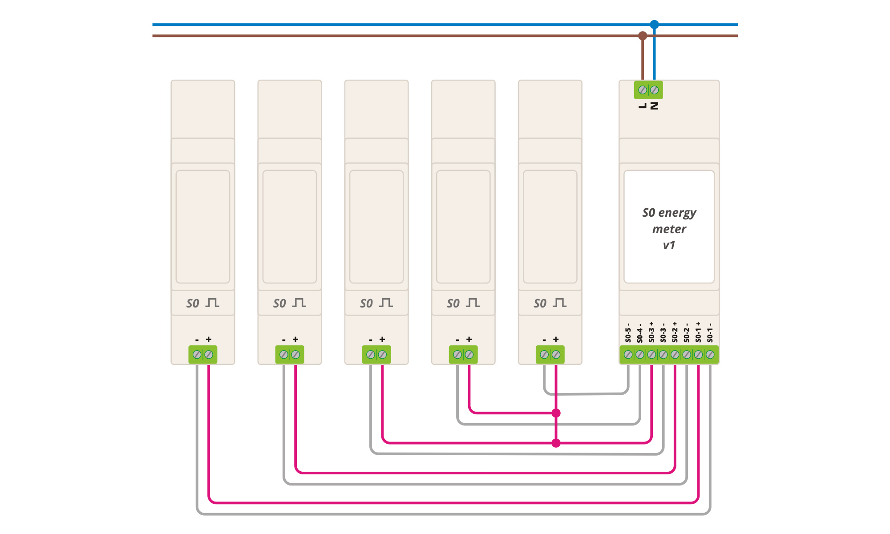

# S0 energy meter
ESP8266 based pulse counter for home utility meter compatible with ESPHome, Tasmota, etc.

## Basic model

**Features**:
- 230V direct power supply
- 5x S0 pulse meter input
- [ESPHome config](./config/S0-energy-meter.yaml)

## Enhanced model

**Features**:
- 230V direct power supply
- 1x S0 pulse meter input
- 2x input ie. for button or door sensor
- 1x SSR relay for light
- doorbell detection
- [ESPHome config](./config/S0-energy-meter-switch.yaml)

